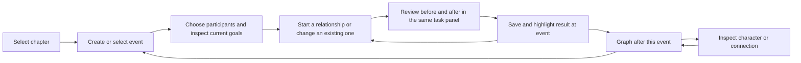

# Story Atlas: competitive UX review and investment priorities

24 September 2026

The highest-value investment is completing common storytelling tasks in one
place. Story Atlas already has substantial functionality; its remaining friction
comes from navigating between representations, understanding historical context,
and working through forms whose controls receive similar visual emphasis.

## Scope and confidence

This is a source-based walkthrough of the current interface and navigation code,
cross-checked against README and official competitor documentation accessed on
the review date. It is not a live visual walkthrough or a hands-on competitor
trial. Findings about controls and routing are directly supported by code;
predictions about confusion and task speed are usability hypotheses to test.
The preceding corrective review reports 147 passing tests and a successful local
packaged smoke test. Those establish functional coverage, not ease of use.

No application behavior or user stories were changed in this assessment.

## What to preserve

- Local, account-free story files and managed backup/recovery.
- Explicit directional/mutual relationships, inverse labels, parallel connections,
  and event-based history. These support a compelling relationship-focused tool;
  this review does not establish that competitors lack equivalent capabilities.
- Characters → Chapters & events → Relationships → Graph organization, with
  optional paths rather than mandatory setup steps.
- The three-pane event workspace, relationship inspector, contextual entry points,
  state preservation, searchable relationship entry, and theme/text-size settings.
- Batch additions must continue to save, clear **every** field, return focus to
  Source, and stay open. Failed saves retain input. Context suggestions must not
  silently refill the cleared form.

## Competitor lessons

These products overlap different parts of Story Atlas; this is a comparison of
documented interaction patterns, not a feature-parity or pricing scorecard.

| Product | Documented functionality | Useful lesson for Story Atlas |
|---|---|---|
| Plottr | Scene cards can be created at a timeline position, moved between chapters/plotlines, and linked to characters, places and tags for filtering. [Scene-card guide](https://docs.plottr.com/article/57-timeline-scene-cards) | Make the event itself the starting point for participants and consequences. Keep creation close to its destination. |
| Novelcrafter | Outline, grid and matrix planning views support different levels of detail; the matrix relates scenes to Codex entries. [Plan views](https://www.novelcrafter.com/help/docs/plan/plan-views) | Use compact summaries for scanning and reveal detail on selection. Character presence across chapters is a useful later view of existing data. |
| Campfire | Timeline events can be arranged and connected, with links to character arcs; its Relationships module provides relationship webs and family trees. [Timeline](https://campfirewriting.com/timeline-maker), [Relationships tutorial](https://campfirewriting.com/learn/relationships-tutorial) | Let chronology and relationship exploration lead into one another without losing context. Avoid adding an entire suite of modules to achieve that. |
| World Anvil | Chronicles connects events with locations/maps and supports exploration through connected records. [Chronicles](https://www.worldanvil.com/features/chronicles) | Make displayed entities actionable: inspect a character or connection where it is mentioned. Maps and custom calendars are outside this polish pass. |

My inference from these patterns: contextual linking and clear levels of detail
are more relevant investments than adding another major feature category.

## Priority 1 — Finish the event workflow in place

**Observed:** `EventRelationshipChangeDialog` opens `StateDialog`, which opens
`StoryChangeReviewDialog`: three stacked task dialogs for an event-context change.
An already-recorded state instead sends the user through History for correction.
The chooser lists all relationships in a read-only dropdown; it prioritizes
participant connections but does not provide search.

**Pain:** A writer thinking “they become enemies here” must manage relationship
selection, state editing, review, and return navigation as separate windows.

**Upgrade:** Keep the event workspace and use one reusable task panel or one
dialog with internal Choose → Describe → Review steps. Show the event and pair
throughout. Search connections and offer “Event participants” / “All cast” scope.
Present “Record a story change” and “Correct an existing entry” as distinct paths,
with the latter explaining that it rewrites an existing state. Retain the
before/after review without opening another window. After success, highlight the
saved change and offer another change or Graph at event.

Also fix the creation handoff: ordinary `EventDialog.save()` refreshes and closes
but does not reveal the newly created ID; `EventView.refresh()` retains the old
selection. Reveal the new event in its chapter and offer the next action there.

**Acceptance:** A new event is immediately selected, including when created in a
different chapter. Record/correct/review paths use at most one task dialog; all
have safe Cancel/Back behavior, unchanged data on failure, and an explicit result.

## Priority 2 — Replace participant-selection friction

**Observed:** The event editor uses a seven-row character table with Ctrl/Shift
multi-selection, no participant search, and includes Trash characters. Inspecting
a selected participant opens a separate read-only profile/goals dialog.

**Upgrade:** Add a searchable checkbox list and a persistent selected-participants
summary. Filtering must never clear selections. Exclude Trash from new choices,
but keep previously linked deleted participants visibly identifiable. Show a
compact read-only goals preview beside/below the chooser. Reuse the existing quick
character creation behavior when needed, explicitly stating that creation saves
the character separately from the unfinished event.

**Acceptance:** Select five nonadjacent people from a 100-character cast using
mouse or keyboard without modifier keys. Search can change without losing chosen
participants. Duplicate names remain distinguishable by role/faction and a stable
ID fallback; names are never merged.

## Priority 3 — Make time and return navigation unmistakable

**Observed:** Event details show current character goals and changes recorded at
that event. Graphs show relationships effective after a selected event. Profiles
and the relationship workspace show Current. These distinctions are documented,
but the same characters appear across these differently scoped views. The Back
controller currently handles profile-to-profile and graph-to-profile navigation;
event-to-graph navigation does not add an event destination.

**Upgrade:** Use a consistent scope strip: “After: Chapter / Event” or “Current —
after the last event.” Label profile/goal summaries “Current profile” when opened
from history. Add “Back to [event]” with chapter, selection and scroll restored.
Keep graph focus, filters and time as separate visible concepts; provide Clear
filters without changing the selected historical event. Do not propagate a
historical date into current-only profile fields or imply they are versioned.

**Acceptance:** A reader can answer “what time does this view represent?” on every
relevant screen. Event → graph → profile → Back → Back restores the exact context.
Historical exports identify their time independently of current profile data.

## Priority 4 — Improve reading density and visual hierarchy

**Observed:** The theme already defines shared primary, secondary, navigation,
validation and destructive styles. The event overview nevertheless puts multiple
fixed-height text/tree widgets inside an outer scroll region. Goals and notes in
Treeviews cannot wrap like prose and can require horizontal scrolling. Profile
overview actions such as Save, Done, Duplicate and Delete remain in a shared bar.

**Upgrade:**

1. Keep the dark palette, but make the selected record title the strongest heading.
   Put chapter, faction, location and counts into quieter metadata rows.
2. Use a compact selectable outline plus a wrapping detail area for long goals
   and notes. Preserve collapse state; aim for one main vertical reading scroll
   per detail pane. Do not remove copy/select accessibility to make text prettier.
3. Give each active task one filled primary action. In read mode use Edit profile;
   in edit mode use Save changes. Put Duplicate/Delete in a labeled More menu;
   retain their keyboard access and Trash recovery.
4. Reserve teal for primary actions/success, amber for unsaved or historical
   context, and red for errors/destructive actions. Always pair meaning with text
   or shape. Selection and keyboard focus must remain visually distinct.
5. Use short field hints instead of repeated instructional paragraphs. Keep longer
   explanations available through Help. Prefer specific labels over several
   unrelated “More” menus where space permits.
6. Keep the three-pane layout at comfortable widths. At narrow widths offer a
   deliberate expand-detail/collapse-navigation control, with a clear return.

**Acceptance:** Long notes are readable without sideways scrolling; main actions
remain visible at 1280×720 and large text sizes. Test light/dark contrast, keyboard
focus, real 100/125/150% Windows scaling, and 900×600 fallback. Current automated
geometry tests are necessary but do not replace this visual check.

## Priority 5 — Make everyday language and saving consistent

**Observed:** Relationship entry provides field-level errors, but event and state
editors use error messageboxes. New relationship forms have semantic, inverse,
event and notes controls together. Profiles have Save plus Done, while other
dialogs close on save and relationship batch entry intentionally remains open.

**Upgrade:** Keep deliberate direction selection, with arrows and examples:
“One-way →” and “Shared ↔.” Explain Source/Target as “From character” and “To
character,” while retaining the established Source focus target. Reveal inverse
labels when directional; make optional timing/details collapsible. Preserve all
hidden values until the user explicitly changes or clears them.

Use “Record story change” for a new historical state and “Correct entry” for
fixing one. Replace database-oriented descriptions such as “Presence” with plain
language (“Active from this event” / “Ends at this event”). Add inline errors in
event/state editors and clear local saved/unsaved feedback. Use “Save and close”
where it closes, and “Add relationship” with an explicit stay-open explanation
for batch entry. Keep Close separately. Recovery-draft messages must never imply
committed saves; broad autosave is not part of this recommendation.

**Acceptance:** Keyboard and mouse follow the same commit/review route. An invalid
field is identified and focused without losing input. Batch tests still verify
that every field clears and Source receives focus after each successful addition.

## Priority 6 — Make the graph answer questions faster

**Observed:** Focus filtering, historical views, an inspector, parallel-edge
selection, saved positions and exports already exist. The renderer assigns
support/conflict/personal categories from a short hard-coded list of type names;
most custom types fall into Other. “Mentor” is classified as supportive, which may
not match a particular story.

**Upgrade:** Start with “Show connections,” “Show two steps,” and “Show changes at
this event” entry points using existing graph state. Add Previous/Next event
controls and an optional change highlight. Keep the complete as-of graph separate
from a changes-only overlay/filter and label/export that distinction. Provide
labels for selected/nearby nodes and a clear edge list when a graph is dense.
Let writers explicitly assign optional visual categories to types; do not infer
that an arbitrary type is friendly or hostile, merge names, or alter semantics.

**Acceptance:** Users can identify the changed pair between adjacent events while
node positions and zoom remain stable. Every parallel/reverse connection remains
individually selectable. Verify readable interaction at 100 characters / 300 links,
not just render duration. Retain NetworkX/Matplotlib for this pass.

## Priority 7 — Put goals where decisions happen

**Observed:** Goals are preserved free text. Cast goals is a read-only text view;
event participants can be inspected, and current goals appear in event details.
These are useful references, but not an editable goal-history system.

**Upgrade:** Add a clearly scoped “Edit current goals” action from the event's
character preview, returning to the exact event. Keep Cast goals searchable and
link each entry to its character. Only after workflow testing, consider a
character-by-chapter participation matrix derived from existing links.

Do not parse existing prose into tasks automatically. Goal status, deadlines and
historical goal changes would be a separate product/schema decision. Current goal
text must not be presented as the character's historical motivation.

## Recommended order of work

Effort is relative engineering scope, not a delivery estimate.

| Pass | Work | Effort | Expected value |
|---|---|---|---|
| 1 | Reveal newly saved events; participant search/checkboxes; inline errors; clear scope labels | Small–medium | Removes frequent interruptions and uncertainty without changing storage |
| 2 | One relationship-change task flow; complete event/graph/profile return navigation | Medium–large | Largest reduction in window management and lost context |
| 3 | Wrapping detail presentation, quieter action hierarchy, adaptive panes | Medium | Easier reading and fewer competing controls |
| 4 | Event comparison in graph; contextual goal editing; optional participation overview | Medium–large | Better story reasoning once basic navigation is smooth |

Defer a renderer/framework rewrite, custom calendars, AI generation, cloud
collaboration, a manuscript editor, and a general form designer. None addresses the
most evident friction in the current workflows.

## Workflow to aim for

This is an optional guided path. Users must still be able to create undated
relationships or begin with a character/graph rather than following a wizard.

## Validate before expanding scope

Run a small formative study with five storytellers. Include a first-time user and
a keyboard-focused user; do not treat five participants as a statistical benchmark.
Use a disposable Greyhaven copy and a 100-character stress dataset.

Tasks: create a name-only character; create an event with five participants;
change allies to enemies at that event; correct an earlier typo without adding a
new story change; compare before/after in the graph; inspect a goal and return;
recover a deleted connection. Include duplicate names and long notes.

Measure completion without assistance, wrong turns, dialog depth, repeated entry,
time on task, and whether users correctly explain current versus historical scope.
Set provisional targets: at least four of five complete each routine task without
help, no silent data loss, no more than one task dialog, and a 25% median reduction
in time for event-plus-relationship work versus the measured baseline. These are
targets, not claimed results. Revise the design if users still need instructions
to find the next action.

## Implementation evidence

- `story_atlas/event_editor.py`: participant table, validation and creation save path.
- `story_atlas/event_view.py`: three-pane workspace, nested detail areas, preserved
  selection and event-to-graph route.
- `story_atlas/event_change_dialog.py`, `history_dialog.py`: chooser/editor/review
  windows and correction route.
- `story_atlas/navigation.py`: current Back destination types.
- `story_atlas/relationship_dialog.py`: blank batch entry, contextual suggestions,
  semantic controls, validation and optional timing.
- `story_atlas/characters.py`, `profile_editor.py`, `profile_overview.py`,
  `goals_view.py`: editing, read mode, actions and current goal presentation.
- `story_atlas/graph_view.py`, `graph_render.py`, `graph_inspector.py`: graph scope,
  style classification and selection.
- `story_atlas/theme.py`, `global_search.py`: established visual vocabulary and
  keyboard-accessible retrieval to build on.
