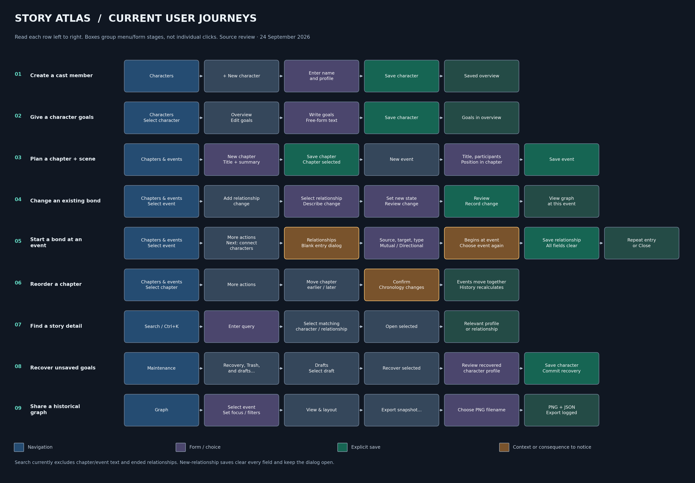

# Story Atlas: product, UX, and implementation review

24 September 2026 · Current source application · Review only; no application behavior changed.

## Assessment

Story Atlas has a strong local data foundation and a useful set of storytelling
features. Its largest remaining problem is the work needed to connect those
features into a continuous writing session. Users can store a cast, motivations,
chapters, events, and changing relationships, but must still reconstruct context
when moving between them. Prioritize contextual actions, retrieval, and a clearer
chapter workspace before adding more major features.

This is a source and automated-test review, not an observed usability study or a
manual screenshot audit. Findings below distinguish implemented behavior from
design judgments. The diagram shows current paths, not a proposed redesign.

[Scalable diagram](user-workflow-map.svg) · Reproduce with
`python tools/generate_workflow_map.py` from the project root.

## Pros: what is working well

| Strength | Why it matters | Evidence |
|---|---|---|
| Local, separate stories | No account dependency; one story's records do not mingle with another's. | `database.py`, `projects.py`, organization tests |
| Transactional migrations and recovery | Upgrades back up existing databases; failed timeline changes roll back. Imports/restores create a new database. | `migrations.py`, `chapters.py`, `imports.py`, `backup.py` |
| Explicit relationship meaning | Directional, mutual, inverse labels, and stable IDs support complex casts and duplicate names. | `relationship_semantics.py`, semantic tests |
| Fictional history is separate from technical activity | An alliance can become hostility without erasing the earlier story state; graphs can show a particular event. | `history.py`, `history_model.py`, narrative tests |
| Efficient relationship batch entry | Successful additions save, clear all fields, refocus Source, and leave the dialog open. Failed saves retain input. | `relationship_dialog.py`, dialog tests |
| Name-only creation and optional detail | Writers can start small; goals use existing profile drafts, saves, search, and backups. | `characters.py`, `profile_editor.py`, chapter/goal tests |
| Shared styling and keyboard support | Themes, text sizing, focus cues, wrapping controls, selectable details, and shortcuts reduce inconsistency. | `theme.py`, `widgets.py`, appearance tests |
| Broad automated regression coverage | Storage, history, recovery, search, graph state, and actual Tk interactions are exercised with disposable data. | `tests/` |

## Cons and areas needing work

### 1. Event-to-relationship creation loses useful context — high priority

**Confirmed behavior:** `EventView.connect_characters()` changes to Relationships
and opens a blank form. The originating event appears in a status message, but
the user must select it again in Begins at event. The event's participant choices
are not carried into the form. By contrast, changing an existing relationship
has a chooser, state editor, review dialog, and completion controls tied to the event.

**Consequence:** Two closely related intentions—start a bond here, change a bond
here—have different paths. This increases remembering and backtracking. This is
a UX assessment, not a measured abandonment rate.

**Upgrade:** Put two explicit actions beside the selected event: **Start a new
relationship here** and **Change an existing relationship**. Show event context
outside the editable entry fields and suggest participants. Offer an explicit
“Use this event” action rather than silently setting a date. Keep the required
successful-save behavior: every field clears, Source receives focus, and the dialog
stays open. Provide a clearly labeled return to the originating event.

**Acceptance:** A user can create and inspect a connection from its event without
visiting another tab or searching the event list again. Batch reset and failed-save
retention tests still pass.

### 2. Chapters are data grouping, but not yet a strong outline workspace — high priority

**Confirmed behavior:** A dropdown filters a flat event table. Chapter editing
and moves live in More actions. The table shows global order while the event
editor requests position within a chapter. Empty chapters have no row in the
all-events table. Unassigned events follow chapters when organization resequences
the chronology. Chapter/event deletion is unavailable.

**Consequence:** The writer must infer the hierarchy and understand two numbering
systems. An event moved out of the selected chapter disappears from that filtered
list after save without a direct destination link.

**Upgrade:** Add a chapter outline on the left, with event counts and a visible
Unassigned group; show that chapter's events on the right. Label numbering
explicitly, show a saved/moved confirmation with “Open destination chapter,” and
preview chronology changes before moving an entire chapter. Keep moves atomic.
Defer deletion until it has a defined history-preserving recovery policy.

**Acceptance:** Empty chapters remain discoverable; selecting a chapter exposes
its summary and events; moving an event gives visible confirmation of where it went.

### 3. Search does not cover the whole story — high priority

**Confirmed behavior:** `retrieval.search()` checks character profile fields
(including goals) and current relationships. It excludes chapter titles/summaries,
event text, and historical/ended relationship states. All relationship history
can reach ended connections, but Ctrl+K cannot find them by their old notes.

**Upgrade:** Add typed Chapter, Event, and Relationship-history results with
snippets. Show “historical” and the effective event explicitly; open the exact
record rather than substituting its current relationship state.

**Acceptance:** Queries found only in an event summary, chapter summary, or ended
relationship notes produce a result and navigate to the correct context.

### 4. Recovery and close behavior are uneven — medium priority

**Confirmed code issue:** `QuickEventDialog.close()` destroys its window without
checking dirty input. Back, Escape, and the window close control can discard a
typed quick-event title. Full event and chapter editors do check unfinished input.
Only character profiles currently have crash-recovery drafts.

**Upgrade:** Give quick-event creation the same Save/Discard/Cancel contract as
the full editor, preserving the pending relationship edit and modal focus. Then
consider recovery drafts for longer chapter/event writing sessions; avoid logging
keystrokes as activity.

**Acceptance:** Cancel retains text and focus; failed saves retain all input;
discard returns to the original relationship editor without committing its change.

### 5. Goals capture intent but cannot yet support goal-oriented planning — medium priority

**Confirmed limitation:** Goals are one free-form profile field. There are no
individual goal records, statuses, event links, or cross-cast goal list.

**Tradeoff:** This is simple and flexible for short notes, but cannot answer
“whose goals changed this chapter?” or “which unresolved goals need a scene?”

**Upgrade:** First add a read-only cross-cast goals view and an explicit link from
event participants to their profiles. Only add individual goal status and event
links after validating that writers need them. Preserve all existing free text
verbatim during any later structured migration.

**Acceptance:** Writers can review participants' motives while planning an event
without losing their event draft. No existing goals text is parsed or split silently.

### 6. Visual cues need a complete workflow-level check — medium priority

**Observed in source:** The palette distinguishes action types and states, but
the application still relies on broad More actions menus, nested modal forms,
and long ID-bearing labels. The graph inspector width is reset on container
resize (`GraphView.size_inspector`) rather than remembered like roster panes.
Back restores specific profile/graph routes; it is not a general tab-history control.

**Upgrade:** Keep one clearly named primary action per task area; pair current,
historical, and unsaved colors with persistent text; label Back with its destination.
Persist the graph split width. Test the chapter page with long titles, duplicate
names, large fonts, and empty data. Use a chapter list instead of trying to fit
long chapter names into a short dropdown.

**Acceptance:** Focus, selection, historical context, and unsaved changes remain
distinguishable in both themes and without depending on color alone. Manual visual
and keyboard checks supplement geometry tests.

### 7. Source/build mismatch can hide completed improvements — high delivery priority

**Confirmed behavior:** `Launch Story Atlas.cmd` prefers an executable in `dist`
over the current source. The preceding implementation work did not rebuild the
package. This review does not assert which schema an existing executable supports.

**Upgrade:** Show application build/version and supported schema in an About
dialog. Provide clearly distinct development and packaged launch paths. Rebuild
and verify a release containing the current migration and features before handing
it to users. Test first launch and upgrade on a clean Windows environment.

**Acceptance:** A tester can identify the running build without inspecting files;
the delivered build opens the current schema and includes Goals and Chapters.

### 8. Maintainability and scale need targeted follow-up — medium priority

**Confirmed structure:** Focused storage modules are a strength. `event_view.py`
now contains the page, event editor, and relationship-change chooser (378 lines at
review); `graph_view.py` has 356 lines. File size alone is not a defect, but these
classes now cover distinct workflows. Event participant and history collections
are scanned repeatedly when composing views.

**Upgrade:** Extract the event editor and relationship-change flow before adding
more features there. Add measured benchmarks for many chapters/events/history
states, not only a graph with 100 characters and 300 relationships. Add focused
regressions for quick-event cancel, chapter selection after moves, and search of
historical content. Avoid a renderer rewrite without a measured limitation.

## Current menu paths: text alternative to the diagram

Each arrow is a UI stage; typing, selection, file picking, and confirmations can
require multiple actions. These are not measured click counts or task times.

| Storytelling goal | Current route | Main friction |
|---|---|---|
| Create a cast member | Characters → + New character → name/details → Save character → Overview | Optional fields require scrolling; name alone works. |
| Give a character goals | Characters → select character → Overview → Edit goals → write → Save character | Goals are text, not tracked tasks. |
| Plan a chapter and scene | Chapters & events → New chapter → title/summary → Save chapter → New event → details/position/participants → Save event | A new event uses the selected chapter; hierarchy is a dropdown. |
| Change a bond at an event | Chapters & events → select event → Add relationship change → select relationship → Describe change → new state → Review change → Record change → View graph at this event | Three nested dialogs; context is retained. |
| Start a bond at an event | Select event → More actions → Next: connect characters → blank relationship dialog → source/target/type/meaning → Begins at event → Save relationship → repeat or Close | Tab switch and event reselection. |
| Reorder a chapter | Chapters & events → chapter selector → More actions → Move chapter earlier/later → confirm | No before/after chronology preview. |
| Find a detail | Search / Ctrl+K → query → select result → Open selected | Chapters, events, and ended relationship history are excluded. |
| Recover unsaved goals | Maintenance → Recovery, Trash, and drafts… → Drafts → select → Recover selected → review profile → Save character | Recovery is a review step, not a committed save. |
| Share a historical graph | Graph → select event and filters → View & layout → Export snapshot… → filename | Produces displayed PNG + JSON, not a complete story backup. |

## Recommended sequence of work

1. **Reliability and delivery:** fix quick-event dirty close, identify the running
   build, and align the packaged release with the current source.
2. **Complete a scene in one place:** contextual new/change relationship actions,
   participant profile/goals access, and return-to-event behavior.
3. **Make chapters visible:** outline, empty chapters, destination feedback, and
   chronology previews. Keep history validation and rollback.
4. **Retrieve the entire story:** chapter/event/history search with exact navigation.
5. **Validate before expanding goals:** observe writers using the above flows;
   introduce structured goal tracking only if free text is insufficient.

Run short observed tasks with writers: create a scene with two participants;
start a friendship there; turn it into hostility later; move the later chapter;
find the original friendship; recover an unsaved goal. Record completion, wrong
turns, backtracking, and misunderstood saves. No task-time targets are claimed
until a baseline is measured.

## Validation and limits

The review reruns the complete unittest suite; its output is stored at
`build-verification/review-2026-09-24-tests.log`. See the final result below.
**Result: 124 tests passed in 38.124 seconds.** The disposable 100-character /
300-relationship graph benchmark measured 1.402 seconds initial display,
0.019 seconds for a notes refresh, and 0.036 seconds for direct focus. These
are local runtime measurements, not human task-completion or usability measures.
Tests use disposable stories and real Tk widgets. Existing appearance tests cover
compact windows, both themes, large text, and simulated Tk scaling; they do not
prove physical Windows DPI behavior, screen-reader usability, or visual clarity.
No user databases were edited, no app redesign was implemented, and no packaged
build was created as part of this review.

Source evidence is in `story_atlas/`: `app.py`, `navigation.py`, `event_view.py`,
`chapter_dialog.py`, `chapters.py`, `quick_event.py`, `profile_editor.py`,
`profile_overview.py`, `retrieval.py`, `recovery.py`, `graph_view.py`, and
`graph_controls.py`. The recommendations are derived from those local workflows;
this is not a new market-research or competitor comparison.
